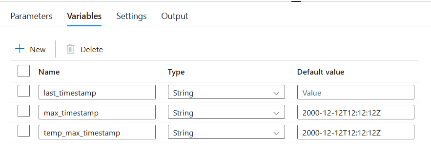
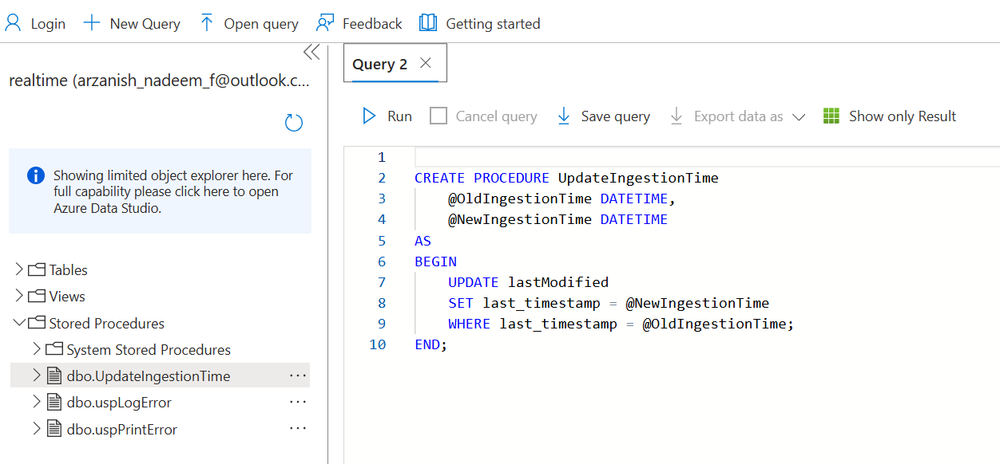
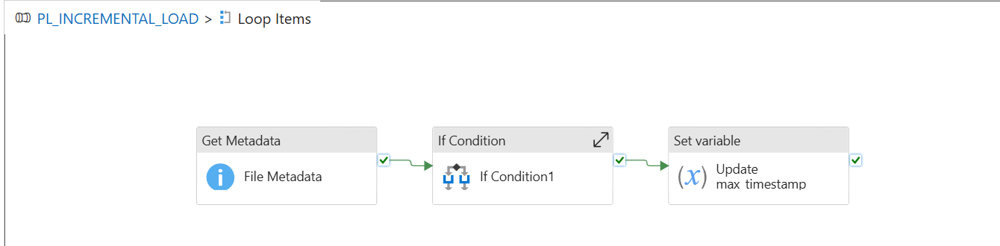
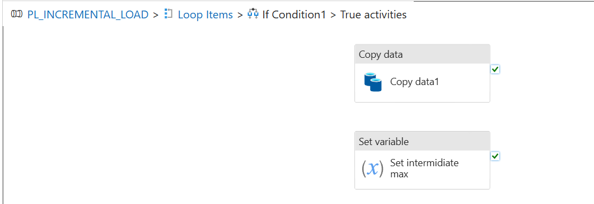

# 🚀 ADF Incremental File Load Pipeline  
### Scalable File-Based Data Ingestion using Azure Data Factory & Synapse Analytics

---

## 📌 Overview

This project demonstrates an automated **Incremental File Load pipeline** built using **Azure Data Factory (ADF)**.  
It processes **only new or updated files** from **Azure Data Lake Storage (ADLS)** and utilizes **Azure Synapse Analytics** to store and manage metadata related to ingestion timestamps.

> ✅ **Key Benefits**  
- Prevents data duplication  
- Enhances performance with metadata-driven control  
- Reduces cloud resource usage and costs

---

## 🏗️ Architecture Flow

### 📍 High-Level Pipeline Design  
> The pipeline follows a control flow that ensures only updated files since the last run are ingested.


---

## 📦 Variables Used in Pipeline  
The following string variables are configured for tracking timestamps during execution:



| Variable Name       | Description                                  | Default Value              |
|---------------------|----------------------------------------------|----------------------------|
| `last_timestamp`    | Timestamp from the last ingestion            | (dynamic via Lookup)       |
| `max_timestamp`     | Latest timestamp during current run          | `2000-12-12T12:12:12Z`     |
| `temp_max_timestamp`| Intermediate timestamp per file              | `2000-12-12T12:12:12Z`     |

---

## 🔄 Pipeline Activities Breakdown

1. **Lookup Activity** – `Get last_timestamp`  
   Retrieves the most recent ingestion timestamp from Synapse table `dbo.lastModified`.

2. **Set Variable** – `SET VAR - last_timestamp`  
   Stores the output of the lookup into a pipeline variable.

3. **Get Metadata** – `Source Metadata`  
   Scans the source folder in ADLS to retrieve list of files and their metadata.

4. **ForEach Activity** – `Loop Items`  
   Iterates over the retrieved list of files.

5. **Stored Procedure** – `Stored Procedure1`  
   Updates the Synapse metadata table with the latest processed timestamp.

---

## 🧠 Stored Procedure Definition  
Used to update ingestion tracking metadata in Synapse:



```sql
CREATE PROCEDURE UpdateIngestionTime  
    @OldIngestionTime DATETIME,  
    @NewIngestionTime DATETIME  
AS  
BEGIN  
    UPDATE lastModified  
    SET last_timestamp = @NewIngestionTime  
    WHERE last_timestamp = @OldIngestionTime;  
END;
````

---

## 🔁 Loop Logic: Per-File Evaluation

### Inside `Loop Items` Activity



| Activity         | Description                                         |
| ---------------- | --------------------------------------------------- |
| **Get Metadata** | Fetches last modified timestamp of each file        |
| **If Condition** | Checks if the file is newer than `last_timestamp`   |
| **Set Variable** | Updates `max_timestamp` if newer timestamp is found |

---

### Inside `If Condition1` (True Branch)



| Activity                 | Description                                     |
| ------------------------ | ----------------------------------------------- |
| **Copy Data**            | Copies new/updated file to destination location |
| **Set Intermediate Max** | Captures file timestamp for comparison          |

---

## 🧾 Summary

* 📁 **Source**: Azure Data Lake Gen2
* 📌 **Control Layer**: Azure Data Factory
* 🗂️ **Metadata Store**: Azure Synapse Analytics
* 🔁 **Logic**: Compare file timestamps and load only delta
* 💡 **Best Practices**: Modular design, variable-driven logic, optimized for cost and performance

---

## 📬 Contact

For any queries or suggestions, feel free to reach out via [LinkedIn](https://www.linkedin.com/in/arzanish-yusuf-nadeem/)

---

> 💡 *This repository showcases practical cloud-native data engineering techniques for incremental ingestion pipelines.*

```

---
