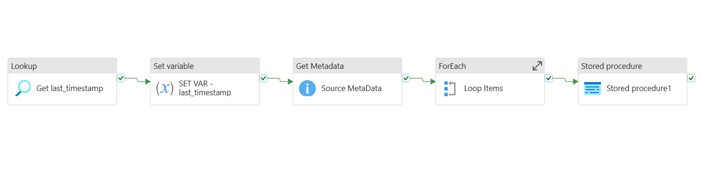

# ADF_Incremental_File_Load
## Designed and deployed a scalable Incremental Data Ingestion pipeline using Azure Data Factory, enabling efficient processing of only new or updated files from Azure Data Lake Storage. Utilized Azure Synapse Analytics to persist and manage the last modified timestamp metadata, significantly improving performance, reducing data redundancy, and optimizing cloud resource utilization.

## Pipeline Flow

1. Get last_timestamp (LOOKUP ACTIVITY) : This **LookUp Activity** will Query the Table **dbo.lastModified** and get the Timestamp of the Last File that was modified.
2. SET Var-lastmodified (SET VARIABLE ACTIVITY) :  This will set the Pipeline Variable **last_timetamp** with the output of the LOOKUP ACTIVITY .
3. Source MetaData (GET METADATA) : This Activity will fetch the details of the Files in the SOURCE FOLDER where the Files are sent over. From this Folder we need to incrementally load the files onto the Destination Folder.
4. Loop Items (FOREACH) : The Previous Activity will send over an array of the CHILD ITEMS of the SOURCE FOLDER.
5. 
